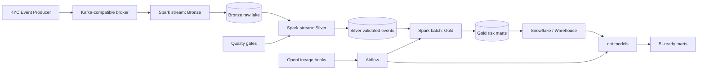
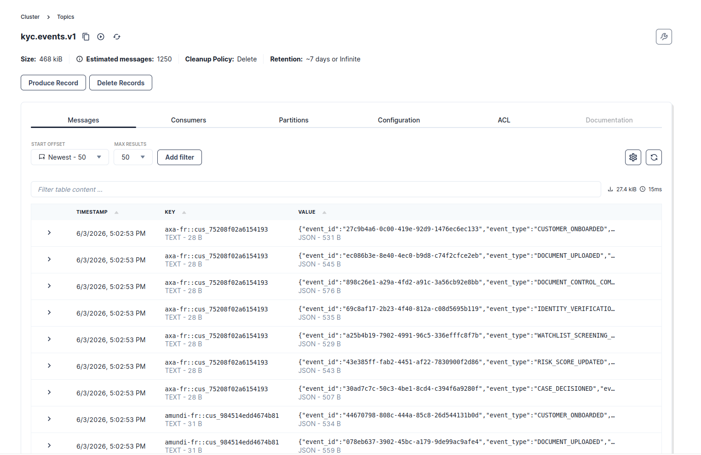
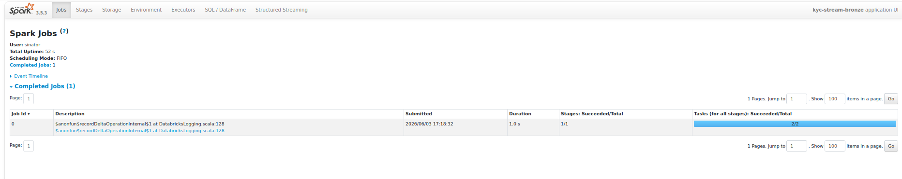
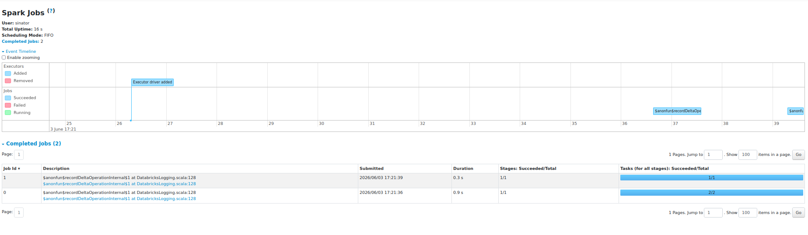
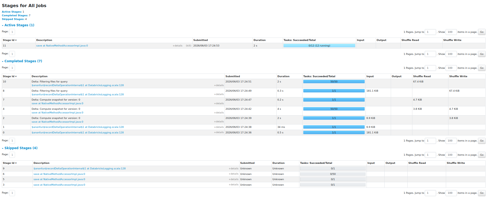
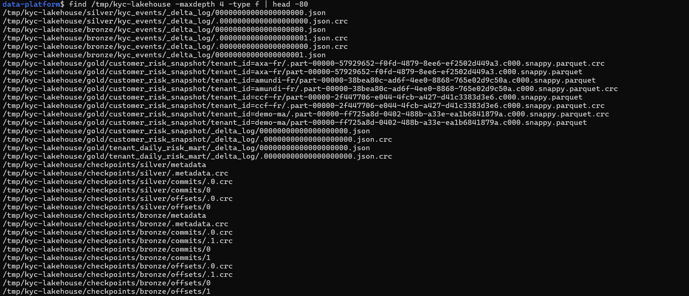
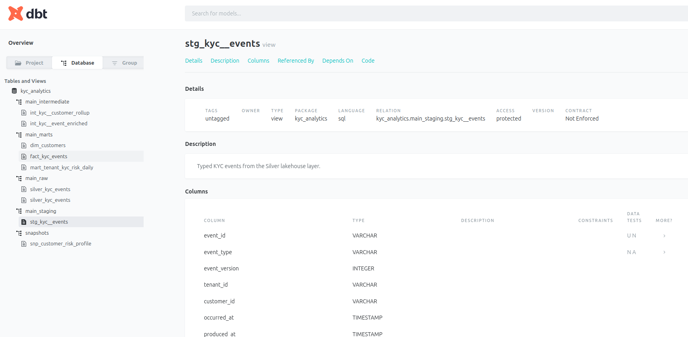
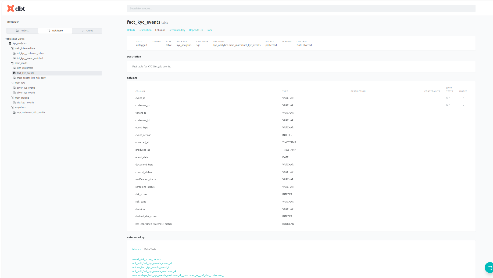
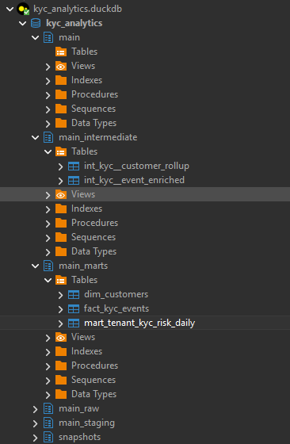

# Real-Time Financial KYC Data Platform

> Reference implementation of a real-time KYC data platform using Kafka-compatible ingestion, PySpark Structured Streaming, Bronze/Silver/Gold lakehouse layers, dbt analytics engineering, Airflow orchestration, data quality checks, and cloud-ready infrastructure templates.


## Problem statement

Financial institutions need to transform fragmented KYC lifecycle events into auditable customer-risk datasets. This project models that problem as an event-driven lakehouse pipeline with local development support and cloud deployment extension points.

The platform covers:

- immutable KYC lifecycle events;
- Kafka-compatible event ingestion with Redpanda;
- Spark Structured Streaming for Bronze and Silver layers;
- customer and tenant risk marts in Gold;
- dbt staging, intermediate, facts, dimensions, marts, tests, and docs;
- data contracts and data quality gates;
- Airflow DAGs for reconciliation and dbt orchestration;
- local-first Docker Compose stack with production extension points for AWS S3 and Snowflake.

## Architecture



## Local execution evidence

The following screenshots were captured from a local end-to-end run of the platform.

| Step | Evidence |
| --- | --- |
| Kafka topic receiving KYC events |  |
| Spark Bronze streaming job |  |
| Spark Silver streaming job |  |
| Spark Bronze, Silver and Gold execution stages |  |
| Local Delta Lakehouse layout |  |
| dbt lineage graph |  |
| dbt model contracts and tests |  |
| DuckDB analytics marts schema |  |

## Implementation map

| Area | Main entry points |
| --- | --- |
| Event contracts | `ingestion/schemas/kyc_event.schema.json`, `docs/DATA_CONTRACTS.md` |
| Event generation | `ingestion/producers/event_factory.py`, `ingestion/producers/kyc_event_producer.py` |
| Stream processing | `spark_jobs/jobs/stream_bronze.py`, `spark_jobs/jobs/stream_silver.py` |
| Reusable Spark logic | `spark_jobs/src/kyc_streaming/transformations.py`, `spark_jobs/src/kyc_streaming/quality.py` |
| Gold aggregation | `spark_jobs/jobs/batch_gold_customer_risk.py` |
| Analytics engineering | `dbt_kyc/models/staging/`, `dbt_kyc/models/intermediate/`, `dbt_kyc/models/marts/` |
| Orchestration | `airflow/dags/kyc_daily_reconciliation_dag.py` |
| Data quality | `data_quality/great_expectations/suites/`, `dbt_kyc/tests/` |
| Deployment templates | `infra/docker/`, `infra/terraform/` |
| Technical documentation | `docs/DECISIONS.md`, `docs/RUNBOOK.md`, `docs/DATA_DICTIONARY.md` |

## Local quickstart

```bash
cp .env.example .env

python -m venv .venv
source .venv/bin/activate
pip install -r requirements-dev.txt

make local-up
make topics
make produce-events
make test
make dbt-build-local
make test-spark
```

Local services:

| Service | URL |
| --- | --- |
| Redpanda Console | http://localhost:8085 |
| MinIO Console | http://localhost:9001 |
| Spark Master UI | http://localhost:8080 |
| Spark application UI | http://localhost:4040, http://localhost:4041, http://localhost:4042 |
| dbt Docs | http://localhost:8089 |

## Running the streaming pipeline locally

Start the infrastructure:

```bash
make local-up
make topics
```

Start the Bronze stream:

```bash
source .venv/bin/activate
export PYTHONPATH=$PWD/spark_jobs/src:$PWD
export JAVA_HOME=/usr/lib/jvm/java-17-openjdk-amd64
export PATH="$JAVA_HOME/bin:$PATH"

spark-submit \
  --packages io.delta:delta-spark_2.12:3.2.1,org.apache.spark:spark-sql-kafka-0-10_2.12:3.5.3 \
  --conf "spark.ui.port=4040" \
  --conf "spark.sql.extensions=io.delta.sql.DeltaSparkSessionExtension" \
  --conf "spark.sql.catalog.spark_catalog=org.apache.spark.sql.delta.catalog.DeltaCatalog" \
  spark_jobs/jobs/stream_bronze.py
```

Produce sample KYC journeys:

```bash
source .venv/bin/activate

python ingestion/producers/kyc_event_producer.py \
  --events 500 \
  --sleep-ms 10 \
  --journey-mode
```

Start the Silver stream after the Bronze Delta table has created its first commit:

```bash
ls /tmp/kyc-lakehouse/bronze/kyc_events/_delta_log/
```

Then:

```bash
source .venv/bin/activate
export PYTHONPATH=$PWD/spark_jobs/src:$PWD
export JAVA_HOME=/usr/lib/jvm/java-17-openjdk-amd64
export PATH="$JAVA_HOME/bin:$PATH"

spark-submit \
  --packages io.delta:delta-spark_2.12:3.2.1 \
  --conf "spark.ui.port=4041" \
  --conf "spark.sql.extensions=io.delta.sql.DeltaSparkSessionExtension" \
  --conf "spark.sql.catalog.spark_catalog=org.apache.spark.sql.delta.catalog.DeltaCatalog" \
  spark_jobs/jobs/stream_silver.py
```

Run the Gold batch job:

```bash
source .venv/bin/activate
export PYTHONPATH=$PWD/spark_jobs/src:$PWD
export JAVA_HOME=/usr/lib/jvm/java-17-openjdk-amd64
export PATH="$JAVA_HOME/bin:$PATH"

spark-submit \
  --packages io.delta:delta-spark_2.12:3.2.1 \
  --conf "spark.ui.port=4042" \
  --conf "spark.sql.extensions=io.delta.sql.DeltaSparkSessionExtension" \
  --conf "spark.sql.catalog.spark_catalog=org.apache.spark.sql.delta.catalog.DeltaCatalog" \
  spark_jobs/jobs/batch_gold_customer_risk.py
```

## Running dbt locally

```bash
cd dbt_kyc

DBT_PROFILES_DIR=. dbt deps
DBT_PROFILES_DIR=. dbt seed --target local
DBT_PROFILES_DIR=. dbt build --target local
DBT_PROFILES_DIR=. dbt docs generate --target local
DBT_PROFILES_DIR=. dbt docs serve --port 8089
```

The local DuckDB warehouse is created at:

```text
dbt_kyc/kyc_analytics.duckdb
```

Useful validation queries:

```sql
select
    table_schema,
    table_name
from information_schema.tables
where table_schema in ('main_raw', 'main_staging', 'main_intermediate', 'main_marts')
order by table_schema, table_name;
```

```sql
select *
from main_marts.dim_customers
limit 20;
```

```sql
select *
from main_marts.mart_tenant_kyc_risk_daily
order by event_date desc, tenant_id
limit 20;
```

## Data model

The platform ingests these KYC lifecycle event types:

- `CUSTOMER_ONBOARDED`
- `DOCUMENT_UPLOADED`
- `DOCUMENT_CONTROL_COMPLETED`
- `IDENTITY_VERIFICATION_COMPLETED`
- `WATCHLIST_SCREENING_COMPLETED`
- `RISK_SCORE_UPDATED`
- `CASE_DECISIONED`

The lakehouse layers are organized as:

| Layer | Purpose |
| --- | --- |
| Bronze | Raw immutable events from Kafka-compatible ingestion |
| Silver | Validated, normalized and quality-tagged KYC events |
| Gold | Customer-risk snapshots and tenant-level operational marts |
| dbt marts | BI-ready facts, dimensions, daily marts and snapshots |

## Design rationale

The pipeline keeps raw events immutable in Bronze, applies validation and normalization in Silver, and builds customer-risk marts in Gold. Invalid records are not discarded; they are isolated with quality reasons so the platform remains auditable in a regulated financial context.

The dbt layer models the warehouse-facing analytics contract: staging views, intermediate enrichment, facts, dimensions, mart tables, data tests, snapshots and documentation.

## Quality gates

The project includes validation at multiple levels:

| Layer | Validation |
| --- | --- |
| Producer | JSON schema-compatible event generation |
| Spark unit tests | Transformation and customer-risk logic |
| Silver layer | Validity flags and quality error reasons |
| dbt | Source tests, uniqueness checks, accepted values, relationships and custom risk-score tests |
| Documentation | Data contracts, runbook, data dictionary and architecture decisions |

Run all local checks:

```bash
make test
make dbt-build-local
make test-spark
```

## Commands

```bash
make help
make local-up
make topics
make produce-events
make test
make test-spark
make lint
make dbt-build-local
make local-down
```

## Screenshot naming convention

Screenshots used in this README should be stored under:

```text
docs/screenshots/
```

Expected files:

```text
01-redpanda-kyc-events-topic.png
02-spark-bronze-streaming-job.png
03-spark-silver-streaming-job.png
04-spark-bronze-silver-gold-streaming-stages.png
05-local-delta-lakehouse-layout.png
06-dbt-lineage-graph.png
07-dbt-model-contract-tests.png
08-duckdb-analytics-marts-schema.png
```

## License

MIT.
